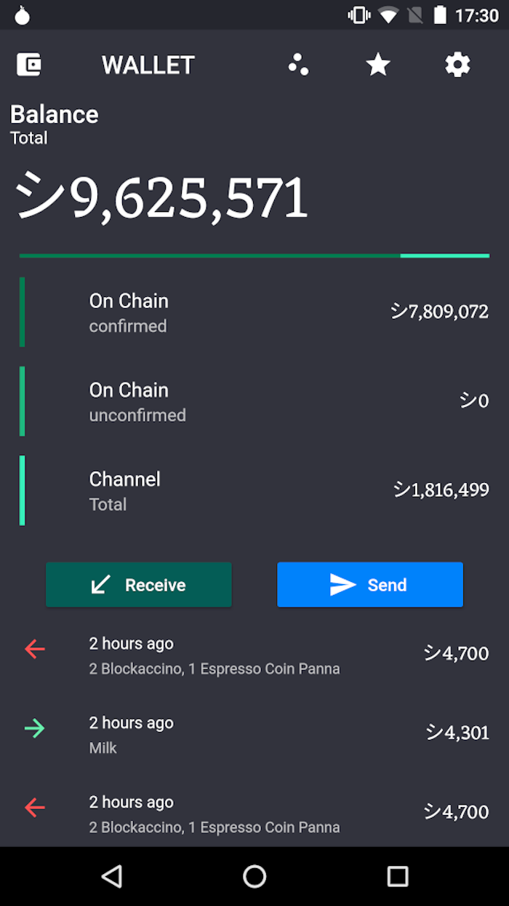
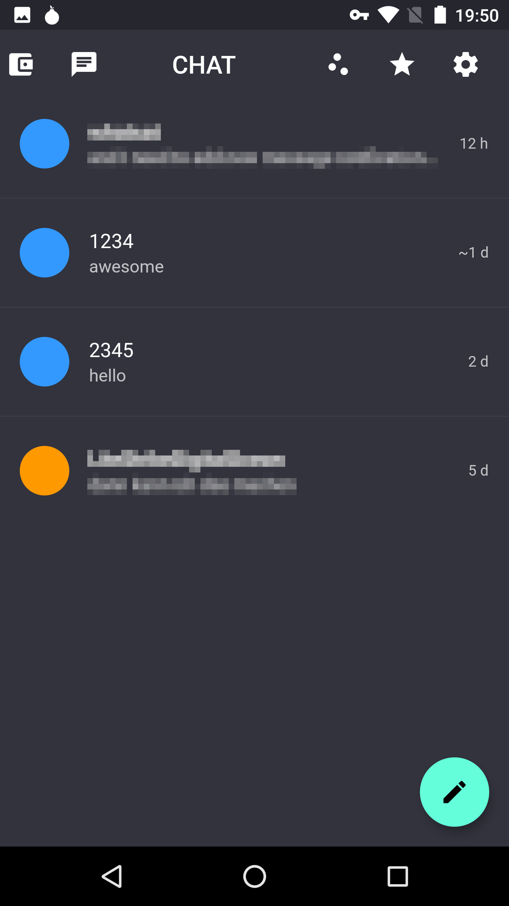
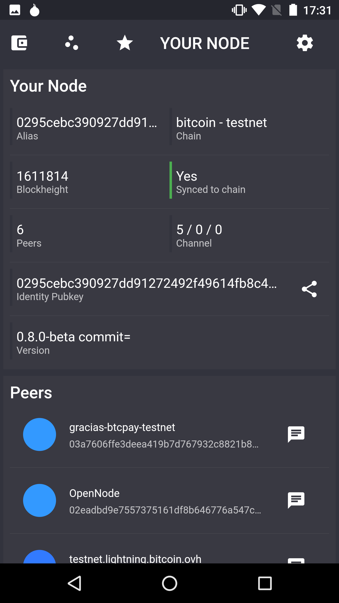
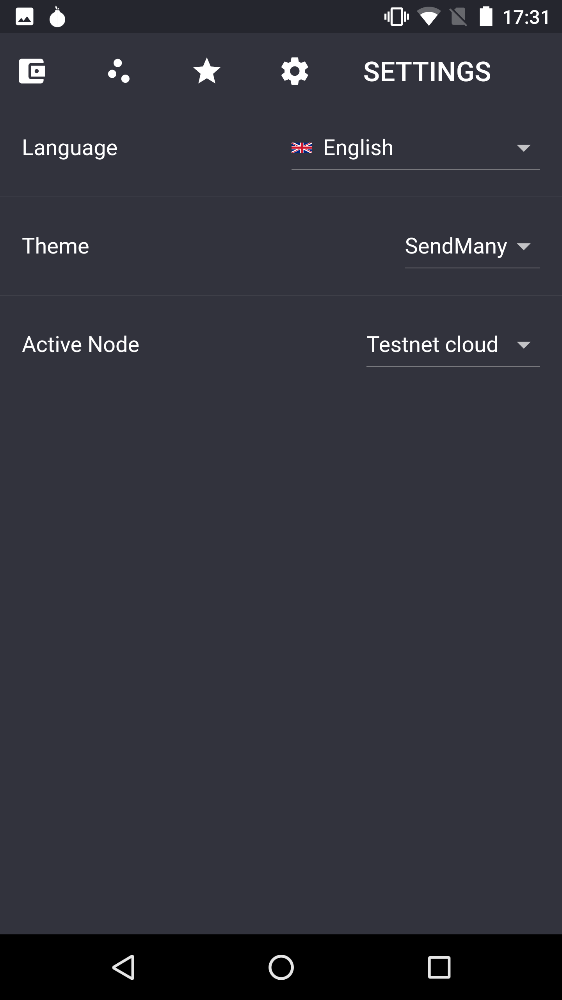

# SendMany
SendMany is an app to remotely connect to your LND node and use it from your phone.

## Disclaimer 
The app is currently still under heavy development and is not recommended for general use. Don't use with Mainnet yet, you might lose your funds.

## Features
   

* Show onchain and channel balances and transactions
* Send and receive funds via onchain and LN transactions
* Open channels with peers
* Get an overview of your nodes current state
* Theme and i18n support
* Multiple node support

## Develop
SendMany is build using the [Flutter-Framework](https://flutter.dev/) and is currently only tested with Android phones. It should work on iOS without modification. To make it look iOS-native, a little more work is required.

* Install flutter for your OS: [Flutter Docs](https://flutter.dev/docs/get-started/install)
* Fork/clone this repository: `git clone https://github.com/fusion44/sendmany`
* execute `flutter run` in the root sendmany folder (make sure you have a phone connected or an emulator running)

### Contribute
If you find any issues please report it through the [Github issue tracker](https://github.com/fusion44/sendmany/issues).
If you are interested in helping push the software forward you are very welcome to submit ideas to the issue tracker and help by opening pull requests.

### Changelog
See [CHANGELOG](CHANGELOG.md)

## Connect your node
Easiest way is to connect via [LNDConnect](https://github.com/LN-Zap/lndconnect). Just scan the QR code and give your node a name.

## Contact
Twitter: https://twitter.com/fusion44

Gitter: https://gitter.im/sendmany/community

## LICENSE
MIT - See the [LICENSE](LICENSE) file.
